## About Me

Engineer who hates inefficiency. (¬_¬)

I build automation and infrastructure tools that simplify processes, using modern stacks to work smarter **(•̀ᴗ•́)و**

Looking to join a team that values clean systems and strong engineering practices.

 

<!-- whoami: monochrome ASCII portrait (types in) beside a neofetch-style info
     panel. regenerate portrait: python scripts/prep_photo.py <photo> &&
     python scripts/make_ascii_svg.py ; info panel: python scripts/make_info_card.py -->

<table>
<tr>
<td valign="top"></td>
<td valign="top"></td>
</tr>
</table>

 

## Projects I Contribute To

Personal projects that show how I build and ship ٩(˘◡˘)۶

| Project | Description | Links |
|---|---|---|
| **ThaiBridge Academy** | Full-stack Thai language learning platform built with React, TypeScript, FastAPI and Supabase. | [Live](https://thaibridge.academy) · [GitHub](https://github.com/germainelry/thaibridge-academy) |
| **ChatBit** | Customer-support chatbot with agent oversight and a knowledge base, powered by open-source LLMs via HuggingFace. | [Demo](https://chatbit.germaineluah.com) · [GitHub](https://github.com/germainelry/chatbit) |
| **Pixel Berry VSCode Theme** | A custom VSCode color theme with a warm berry-inspired palette. | [GitHub](https://github.com/germainelry/pixel-berry-vscode-theme) |
| **UOB Multilingual Chatbot** | Multilingual chatbot for banking customer experience, built for the UOB Tech Development Programme 2024. | [GitHub](https://github.com/KevinTan1203/TDP-LLM-Chatbot.git) |
| **YouTube Sub Manager** | Chrome extension that finds stale YouTube subscriptions, checks upload activity and bulk unsubscribes. 100% local, no API keys needed. | [GitHub](https://github.com/germainelry/youtube-sub-manager) |

---

  <i>Building things and learning as I go — would love to connect and maybe build something meaningful together! (◠‿◠)</i>

  &nbsp;&nbsp;
  &nbsp;&nbsp;
  &nbsp;&nbsp;
  <a href="https://github.com/germainelry" target="_blank"><picture><source media="(prefers-color-scheme: dark)" srcset="https://cdn.simpleicons.org/github/white"></picture></a>

